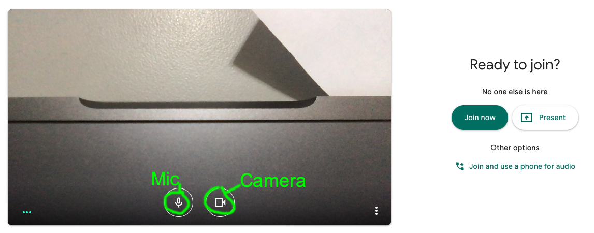
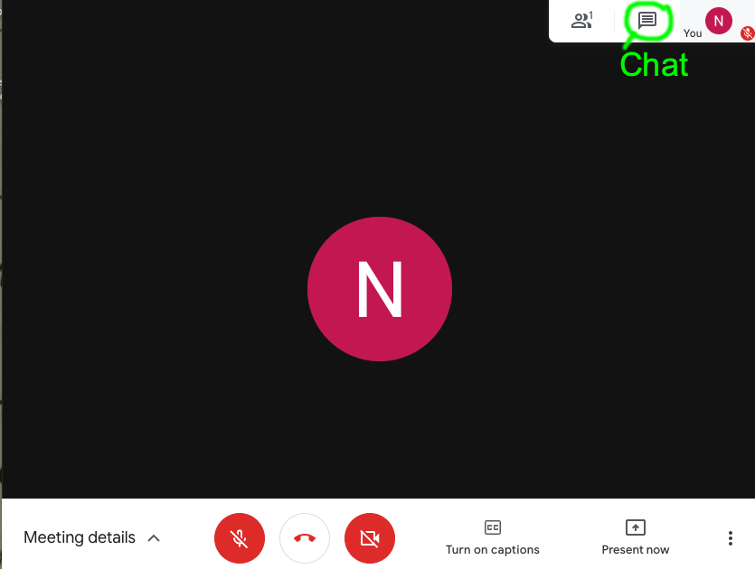
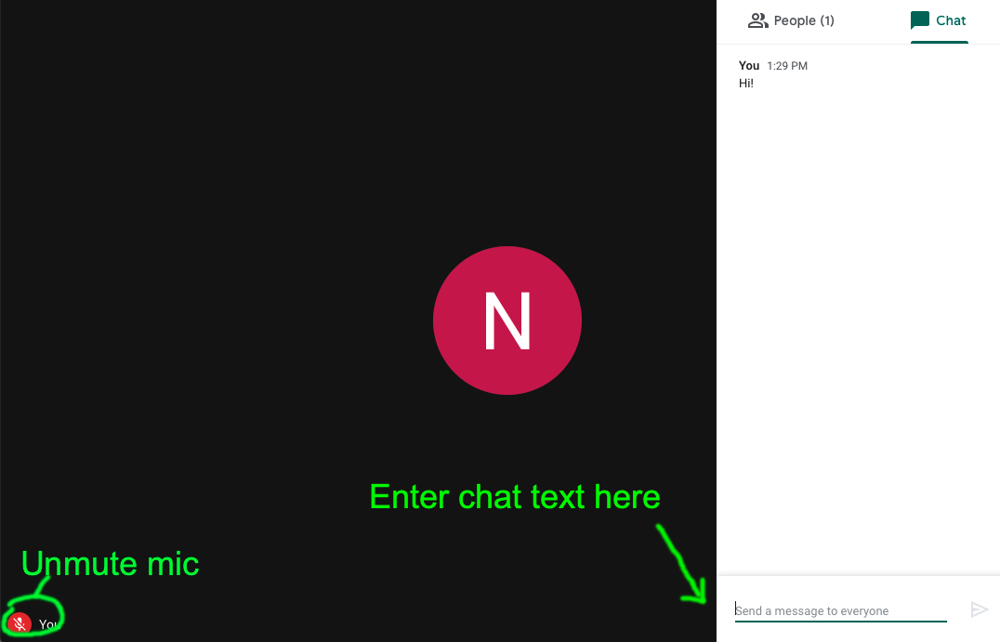
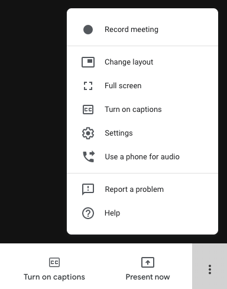

### Overview

Google Meets are limited to users from `holycross.edu` accounts.

#### Ways you can participate

- **Video** (optional): if you have low bandwidth, consider turning it off
- **Audio**:  probably best to turn off (mute) when you're not speaking.  It can also help prevent audio feedback if you use headphones when speaking.
- **Chat**: you can type comments and see what others are typing.  Best to keep this open so you can follow if others do not have an audio connection.

### How to use a web browser with a Meet

#### 1. Join the Meet

In a web browser, use [this link](https://meet.google.com/ojf-hqdm-hif).  

You should see something like this when you follow the link to a Meet.

> Suggestion: before clicking "Join now", click on the Mic button to **mute yourself** initially.

Click on the "Join now" button.

#### 2. Open the chat stream

You should connect to the Meet and see something similar to the following screen shot. In the example below, both the Mic and the Camera are turned off, so instead of the camera's input, you see a text display with the initial letter of your name.

To display the chat stream at the same time, use the button circled in green.

#### 3. Unmute your mic to speak

With the chat stream open, the bar of buttons will be hidden.

You can add comments at the bottom of the chat stream.

If you want to unmute your mic, use the "You" link labelled in green here "Unmute mic".  That restores the buttons as in the previous screen shot.

#### 4. Changing settings: proceed at your own risk

At the bottom right of the screen, clicking the three stacked dots will open the settings menu as illustrated in the following screen shot.

If you change the layout, your display will look different from the screen shots in this document.

> Suggestion: try out different settings before or after your group gets together rather in the middle of a discussion.
