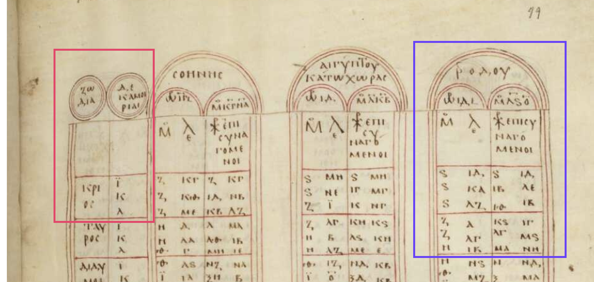
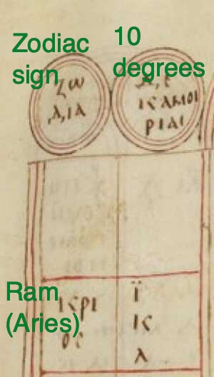
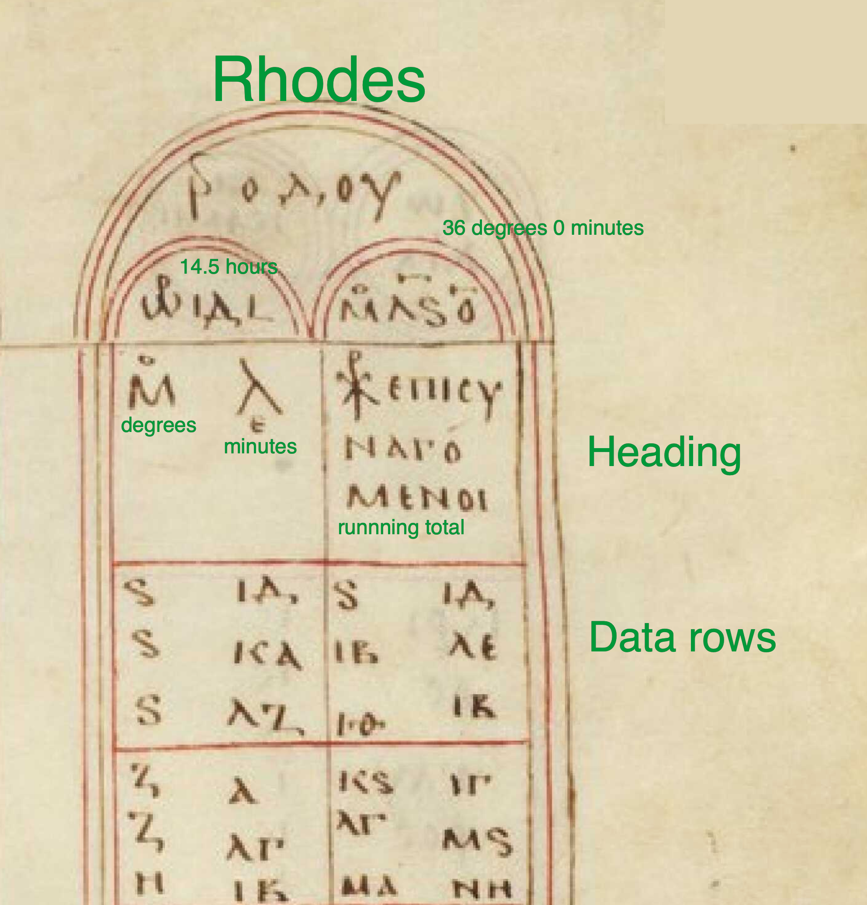

## Overview

This "quiz" is really a worksheet.  You should use this guide and any other resources you need to complete it.  

You will use the incredibly versatile table of rising times to determine the number of hours of daylight on a given date at the latitude of Rhodes.  The "quiz" will have one question:  how many hours long is the day on the latitude of Rhodes on the first day of spring, when the sun is at 0 degrees into the sign of the Ram (Aries)?

## Background

From Moodle, read Evans, "A Table of Rising Times."

## How to find the date

Ptolemy himself gives us instructions in *Almagest 2.8*:

> One can find the length of a given day or night as follows. Take the rising-times of the appropriate latitude; for the day, count from the degree in which the sun is to the degree diametrically opposite, going towards the rear through the signs...  Form the sum of of the 180°, and divide by 1:  this will give the interval in equinoctial hours.

Paraphrasing this, we can find the length of daylight by:

1. finding the row for our date (first day of spring) by finding 0 degrees of the Ram
2. reading across to the data for our latitude (Rhodes)
3. note the value at 0 degrees of the Ram
4. since six signs rise and set in a day, count down six constellation blocks, and read the value at 30 degrees of that sign
5. subtract the starting value from the ending value

This is the answer in degrees.  Since 360° is 24 hours, 1 hour is 15 degrees.  Divide your total number of hours by 15 to find your answer.

## Navigating the Paris *Almagest*

This is folio 44 recto of the Paris *Almagest*. It includes the section of Ptolemy's table of rising times for Rhodes.  To use the table, you need to be able to read the entry for a section of the ecliptic circle (the red box here), and the entries for a specific latitude such as Rhodes (the blue box here).

### Rising time on the ecliptic circle

In the image below (linked to a zoomable version), the two circular headings label columns for the  "Zodiac sign" and "10-degree intervals."

The first zodiac sign is the Ram (Aries). The adjacent column labels rows for 10, 20 and 30 degrees along the Ram.  (Remember that each of the twelve zodiac signs is a 30-minute division of the 360-degree zodiac circle.)

### Rising times

The large semicircle at the top labels these columns as "Rhodes."  The two smaller semicircles below give the location of Rhodes in hours of the longest day (14.5) and in latitude (36 degrees, 0 minutes).

Below that, the first row is a header.  The left-hand column is labelled "minutes seconds" and the right-hand column is labelled "running total."

Below that, each row is a successive data row.

