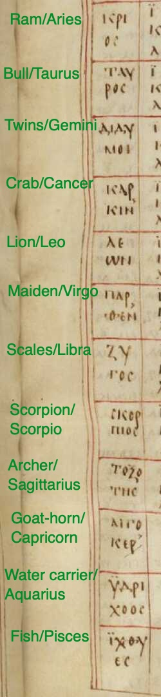

## Overview

This Moodle "quiz" (available in the "Quizzes and worksheets" section on Moodle) is really a worksheet.  You should use this guide and any other resources you need to complete it.  

You will use Ptolemy's extremely versatile table of rising times to determine the number of hours of daylight on a given date at the latitude of Rhodes.  The worksheeet has the following seven questions:  

1. For questions 1 and 2, reading on folio 44 recto of the Paris MS of the Almagest, when the sun is in the 20th degree of the Ram, or Aries, (roughly, April 9), what is the value of the "running total" column for the latitude of Rhodes? **____ degrees and**
2. **____ minutes**
3. For questions 3 and 4, reading down 6 constellations, what is the value for the "running total" column six constellations later (20° in the Scales/Libra)? **____ degrees and**
2. **____ minutes**
5. For questions 5 and 6, what is the length of the day (ie, the total time the sun is above the horizon) on Aries 20° at Rhodes, measured in "time degrees"?  **____ degrees and**
2. **____ minutes**
7. What is the length of the day (ie, the total time the sun is above the horizon) on Aries 20° at Rhodes, measured in hours, to one decimal place? **_____  hours**

## Background

On Moodle, read Evans, "A Table of Rising Times." Evans shows you now to use a modern table of rising times to compute several things, including the length of the day on a given date.  You will do the same thing using the authentic Ptolemaic table in the Paris manuscript of the *Almagest*.

## How to find the length of the day from a table of rising times

Ptolemy sets out his table of rising times in *Almagest* 2.8, and is clearly pleased with it, as he gives us instructions in 2.9 on the various ways you can use the table.  This is his explanation for how to find the length of the day:

> One can find the length of a given day or night as follows. Take the rising-times of the appropriate latitude; for the day, count from the degree in which the sun is to the degree diametrically opposite, going towards the rear through the signs...  Form the sum of of the 180°, and divide by 1:  this will give the interval in equinoctial hours.

Paraphrasing this, we can find the length of daylight by:

1. finding the row for our date (April 9 ~= when the sun is 20° in to the Ram (Aries)
2. reading across to the rising time for our latitude (Rhodes)
3. note the value for the running total at Rhodes for 20° degrees in to the Ram
4. since six signs rise and set in a day, count down six constellation blocks, and read the value at 20° in to that sign
5. subtract the starting value in step 3 from the ending value in step 4

This is the answer in degrees and minutes.  Since 360° is 24 hours, 1 hour is 15 degrees.  You can divide your total number of degrees and minutes by 15 to express your answer in hours.

## Navigating the Paris *Almagest*

Folio 44 recto of the Paris *Almagest*  includes the section of Ptolemy's table of rising times for Rhodes.  To use the table, you need to be able to find a calendar date expressed as the sun's position on the ecliptic circle (the red box here), and then read the corresponding entry for a specific latitude such as Rhodes (the blue box here).

### Find a calendar date on the ecliptic circle

The image below is linked to a zoomable version.  The two circular headings label columns for the  "Zodiac sign" and "10-degree intervals."

The first zodiac sign is the Ram (Aries). The adjacent column labels rows for 10, 20 and 30 degrees in to the Ram.  (Remember that each of the twelve zodiac signs is a 30-minute subdivision of the 360-degree zodiac circle.)

### Rising times

The large semicircle at the top labels these columns as "Rhodes."  The two smaller semicircles below give the latitude of Rhodes expressed both as hours of the longest day of the year (14.5) and as latitude (36 degrees, 0 minutes).

Below that, the first row is a header.  The left-hand column is labelled "minutes seconds" and the right-hand column is labelled "running total."

Following that, each row is a successive data row.

Notice that the scribe uses red guidelines to group today three rows for each constellation (10, 20 and 30 degree values).  This makes it easy for you to count down six constellations and find the running total for 20 degrees of that constellation.

## For your reference

Here are the names of the constellations in English translation with their traditional astrological equivalnet (taken from Latin)

