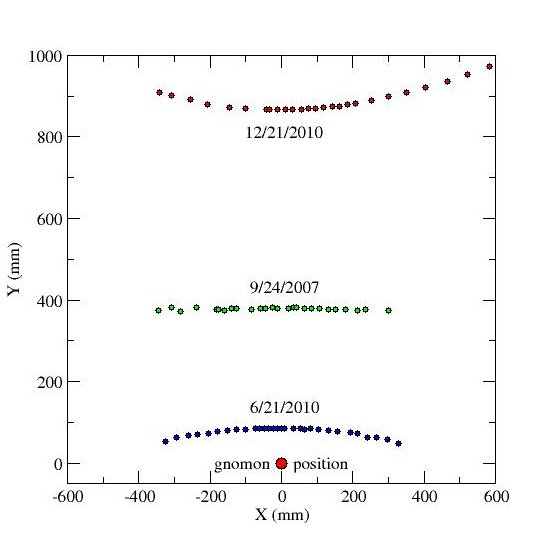

AMDG

Your name:

## Quiz: use of the *gnomon*

The following illustrations shows three shadow plots taken
at a latitude of 30.6° north of the equator on the dates labelling each series of points.  

The labelled circle at the bottom of the figure indicates the position of the gnomon.

### Figure 1

### Questions

1. Explain how you could construct a line from the gnomon to any one of the three shadow plot series in order to find true north.  Draw a line from the gnomon to one of the shadow plots approximating this.
2. In what hour of the day as recorded on your clock, plus or minus 20-30 minutes, would you expect the sun to touch this point?
3. On any one of the three series, label the *earliest* point recorded in the day as "morning" and the *latest* point recorded in the day as "evening."
