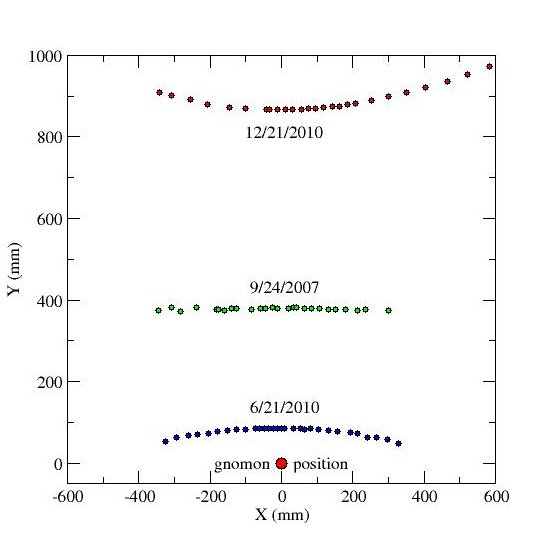
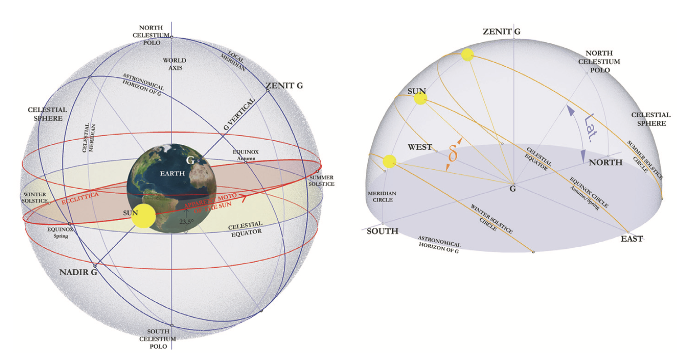

## Ptolemy, *Criterion*

How do we make scientific judgments?

- act
- instrument
- agent
- means
- goal

---

Time-lapse photograph:

---

## History of gnomon

- Diogenes Laertius, *Lives of the Philosophers* (3rd c. CE):  Anaximander discovered the *gnomon*
- Herodotus 2.109 (5th c BCE):  the Greeks learned the use of the *gnomon* from the Babylonians

Etymologically: "the judge" or "decider"

(Also defined in Euclid, *Elements of Geometry* book 2…)

---

Shadow plots:

---

- Rome: 41.9° N
- Constantinople: 41° N
- Athens:~ 38° N
- Alexandria: 31.2° N

- Washington, DC: 38.9° N
- Worcester:  42.26° N

---

---

## Horizon line

- viewer's *latitude*

---

## Longitude?

- cannot be inferred from a single observation!

---

## Clock time vs. sun time

- "local hours" = 1/12 of daylight
- "equal hours" = 1/24 of a day

---

## Sundials?

Make your own on pinterest:

---

## Calendars?

- Progress from solstice to equinox?

---

## Context

- Observation->Theory->Model
- Same instrument for measurement/observation and prediction

---

## Tuesday

- Euclid vs. Archimedes, *The Method* : proof vs. data exploration

---
